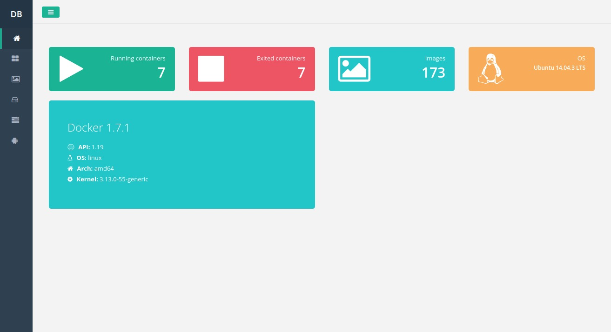
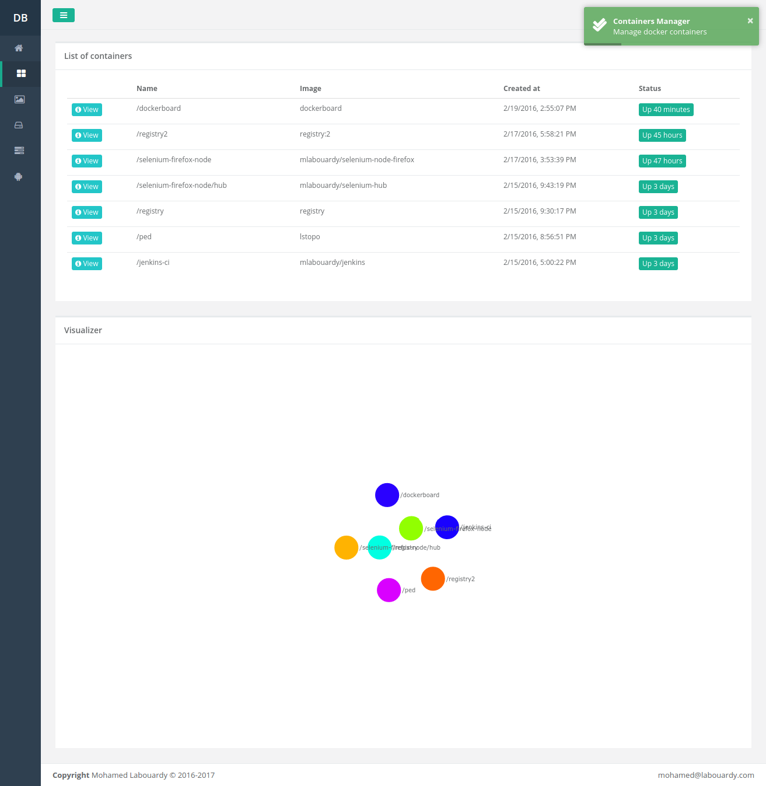
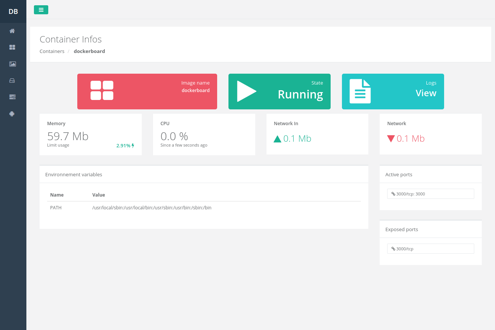
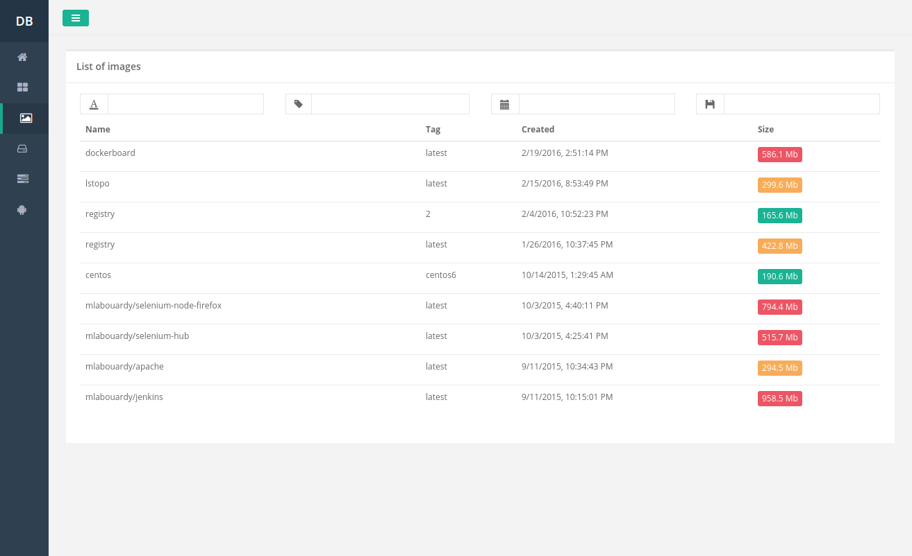
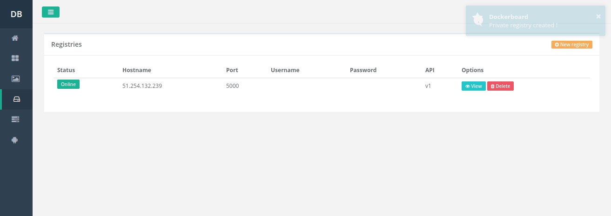
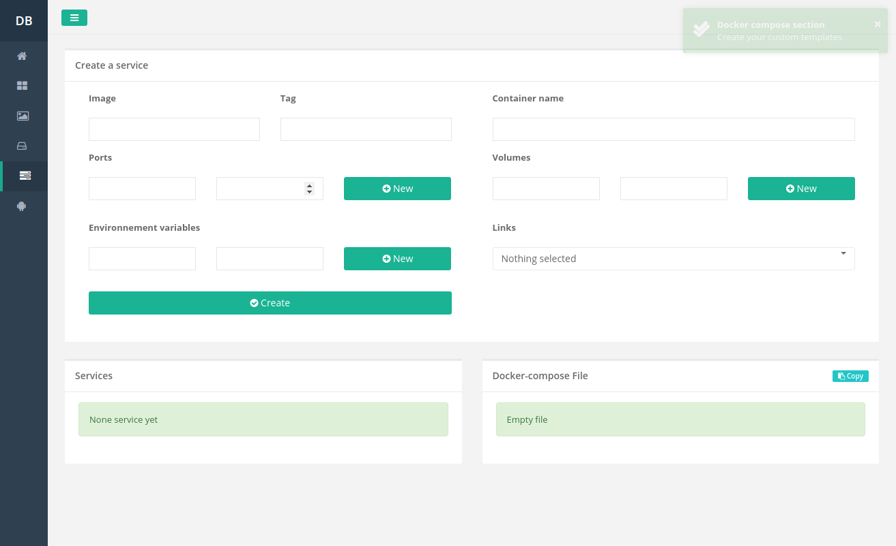

# Dockerboard

Manage docker Containers

# Run

```sh
docker run -d -p 3000:3000 -v /var/run/docker.sock:/var/run/docker.sock --name dockerboard mlabouardy/dockerboard:4.0
```

# Screenshots

<p align="center">d
  
  
  
  
  
  
</p>

# Docker Images

Image | Tag
------------ | -------------
mlabouardy/dockerboard | 4.0
mlabouardy/dockerboard | 3.0
mlabouardy/dockerboard | 2.0
mlabouardy/dockerboard | 1.0
